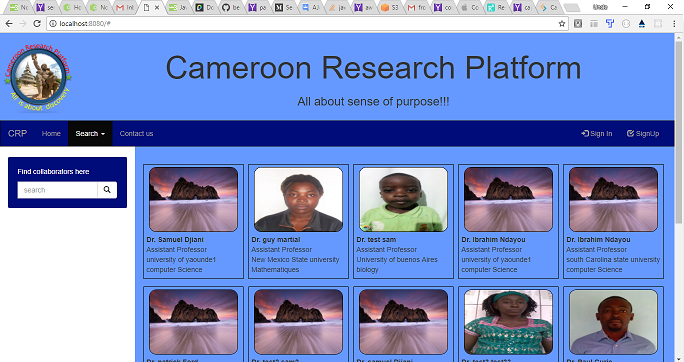

UnivProf: Cameroon Research Platform
-------------------------------------
This web application is organize as follow. As you visit it, you can be able to query the database by user'sname, by country, by university, or by speciality to search all existent users that satisfy the search criteria. By click on image picture of particular user, It offer to view more information about that user such as his cv, biography or a short summary of his researchers etc. Another way to query the database, it is by using the search button in the navigation bar, and you should be able to either list existent users in the database, or list all existant users by special country and speciality. An autorize user(a university professor) should to able to create a free account and apload his cv, loggin to his account, view and/ modify your infos or delete his account. 

Descrption
------------------------------------
As today, There is not a common platform where you can find cameroon professors or african professors, except those who teach out of the country. And therefore, it becomes so challenging for others professors around the world to collaborate with them. Cameroon Research Platform is a web platform design in the first place to share and promote Cameroonian professors but also, african professors, or all university profossors who would like to collaborate with others professors around the world. We encourage all cameroonian professors, all african professors, or any professor to register to this app and upload his cv and share his research insterest with others in other to build a strong network.   

Technology
-----------------------------------
- Front-end Technology: HTML5/CSS/Boostrap/Jquery/Ajax
- Backend Technology used are: Node.js(Express),
- Database: mongodb,
- Test: Mocha,
- The app is fully responsible and suitable adapted for mobile, tablets, desktop viewports. 

Contributors
-----------------------------------
- Samuel Djiani

Bug Reoport to 
-----------------------------------
- Email me at <djiasara@gmail.com>